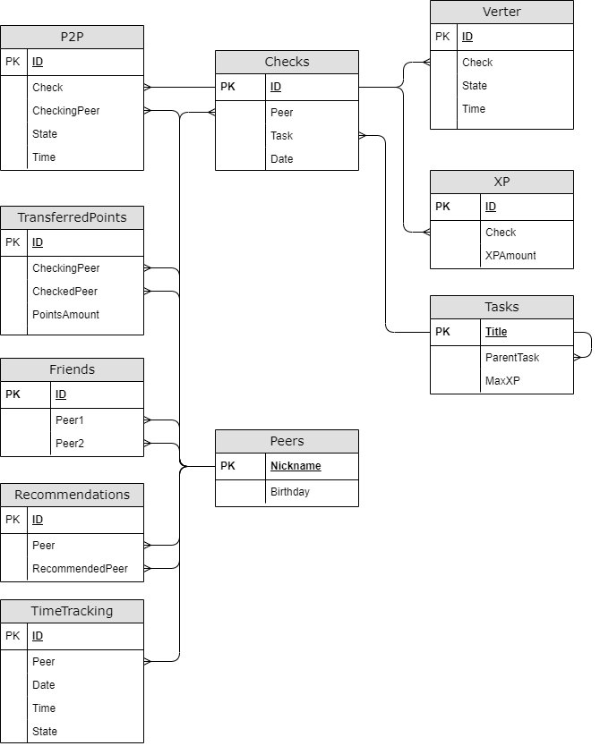

# Project SQL
##
Учебный проект по созданию, анализу и статистики базы данных "Школа программирования". 
Написаны процедуры и функции для получения информации, а также процедуры и триггеры для её изменения на PostgreSQL.

#
##
## Contents

1. [Chapter I - Логическое представление модели базы данных](#chapter-i) 
2. [Chapter II](#chapter-ii) \
    2.1. [Part 1. Создание базы данных](#part-1-создание-базы-данных)  \
    2.2. [Part 2. Изменение данных](#part-2-изменение-данных)  \
    2.3. [Part 3. Получение данных](#part-3-получение-данных)  \
    2.4. [Дополнительно. Part 4. Метаданные](#дополнительно-part-4-метаданные)  

#
## Тестов
Чтобы проверить корректность работы реализованных функций и процелур в данном провекте, подготовлены тесты, находящиеся по адресу tests/tests.sql

#
## Chapter I - Логическое представление модели базы данных

*Все поля при описании таблиц перечислены в том же порядке, что и на схеме.*

#### Таблица Peers

- Ник пира
- День рождения

#### Таблица Tasks

- Название задания
- Название задания, являющегося условием входа
- Максимальное количество XP

Чтобы получить доступ к заданию, нужно выполнить задание, являющееся его условием входа.
Для упрощения будем считать, что у каждого задания всего одно условие входа.
В таблице должно быть одно задание, у которого нет условия входа (т.е. поле ParentTask равно null).

#### Статус проверки

Создать тип перечисления для статуса проверки, содержащий следующие значения:
- Start - начало проверки
- Success - успешное окончание проверки
- Failure - неудачное окончание проверки

#### Таблица P2P

- ID
- ID проверки
- Ник проверяющего пира
- [Статус P2P проверки](#статус-проверки)
- Время

Каждая P2P проверка состоит из 2-х записей в таблице: первая имеет статус начало, вторая - успех или неуспех. \
В таблице не может быть больше одной незавершенной P2P проверки, относящейся к конкретному заданию, пиру и проверяющему. \
Каждая P2P проверка (т.е. обе записи, из которых она состоит) ссылается на проверку в таблице Checks, к которой она относится.

#### Таблица Verter

- ID
- ID проверки
- [Статус проверки Verter'ом](#статус-проверки)
- Время 

Каждая проверка Verter'ом состоит из 2-х записей в таблице: первая имеет статус начало, вторая - успех или неуспех. \
Каждая проверка Verter'ом (т.е. обе записи, из которых она состоит) ссылается на проверку в таблице Checks, к которой она относится. \
Проверка Verter'ом может ссылаться только на те проверки в таблице Checks, которые уже включают в себя успешную P2P проверку.

#### Таблица Checks

- ID 
- Ник пира
- Название задания
- Дата проверки

Описывает проверку задания в целом. Проверка обязательно включает в себя **один** этап P2P и, возможно, этап Verter.
Для упрощения будем считать, что пир ту пир и автотесты, относящиеся к одной проверке, всегда происходят в один день.

Проверка считается успешной, если соответствующий P2P этап успешен, а этап Verter успешен, либо отсутствует.
Проверка считается неуспешной, хоть один из этапов неуспешен.
То есть проверки, в которых ещё не завершился этап P2P, или этап P2P успешен, но ещё не завершился этап Verter, не относятся ни к успешным, ни к неуспешным.

#### Таблица TransferredPoints

- ID
- Ник проверяющего пира
- Ник проверяемого пира
- Количество переданных пир поинтов за всё время (только от проверяемого к проверяющему)

При каждой P2P проверке проверяемый пир передаёт один пир поинт проверяющему.
Эта таблица содержит все пары проверяемый-проверяющий и кол-во переданных пир поинтов, то есть, 
другими словами, количество P2P проверок указанного проверяемого пира, данным проверяющим.

#### Таблица Friends

- ID
- Ник первого пира
- Ник второго пира 

Дружба взаимная, т.е. первый пир является другом второго, а второй -- другом первого.

#### Таблица Recommendations

- ID
- Ник пира
- Ник пира, к которому рекомендуют идти на проверку

Каждому может понравиться, как проходила P2P проверка у того или иного пира. 
Пир, указанный в поле Peer, рекомендует проходить P2P проверку у пира из поля RecommendedPeer. 
Каждый пир может рекомендовать как ни одного, так и сразу несколько проверяющих.

#### Таблица XP

- ID
- ID проверки
- Количество полученного XP

За каждую успешную проверку пир, выполнивший задание, получает какое-то количество XP, отображаемое в этой таблице. 
Количество XP не может превышать максимальное доступное для проверяемой задачи. 
Первое поле этой таблицы может ссылаться только на успешные проверки.

#### Таблица TimeTracking

- ID
- Ник пира
- Дата
- Время
- Состояние (1 - пришел, 2 - вышел)

Данная таблица содержит информация о посещениях пирами кампуса. 
Когда пир входит в кампус, в таблицу добавляется запись с состоянием 1, когда покидает - с состоянием 2. 

В заданиях, относящихся к этой таблице, под действием "выходить" подразумеваются все покидания кампуса за день, кроме последнего. 
В течение одного дня должно быть одинаковое количество записей с состоянием 1 и состоянием 2 для каждого пира.

Например:

| ID | Peer  | Date     | Time  | State |
|----|-------|----------|-------|-------|
| 1  | Aboba | 22.03.22 | 13:37 | 1     |
| 2  | Aboba | 22.03.22 | 15:48 | 2     |
| 3  | Aboba | 22.03.22 | 16:02 | 1     |
| 4  | Aboba | 22.03.22 | 20:00 | 2     |

В этом примере "выходом" является только запись с ID, равным 2. Пир с ником Aboba выходил из кампуса на 14 минут.

#
##
## Chapter II

#
## Part 1. Создание базы данных
Cкрипт *part1.sql*, создает базу данных и все таблицы, описанные выше. 

Также скрипт включает процедуры, позволяющие импортировать и экспортировать данные для каждой таблицы из файла/в файл с расширением *.csv*. \
В качестве параметра каждой процедуры указывается разделитель *csv* файла.

В каждую из таблиц внесены записи, чтобы проверить все варианты работы. 

#
## Part 2. Изменение данных

Cкрипт *part2.sql* содержит ряд функционала описанного ниже плюс тестовые запросы/вызовы для каждого пункта.

##### 1) Процедура добавляет P2P проверки
Параметры: ник проверяемого, ник проверяющего, название задания, [статус P2P проверки](#статус-проверки), время. \
Если задан статус "начало", добавляет запись в таблицу Checks (в качестве даты использовать сегодняшнюю). \
Добавдяет запись в таблицу P2P. \
Если задан статус "начало", в качестве проверки указывает только что добавленную запись, иначе указывает проверку с незавершенным P2P этапом.

##### 2) Процедура добавляет проверки Verter'ом
Параметры: ник проверяемого, название задания, [статус проверки Verter'ом](#статус-проверки), время. \
Добавляет запись в таблицу Verter (в качестве проверки указывает проверку соответствующего задания с самым поздним (по времени) успешным P2P этапом)

##### 3) Триггер: после добавления записи со статутом "начало" в таблицу P2P, изменяет соответствующую запись в таблице TransferredPoints

##### 4) Триггер: перед добавлением записи в таблицу XP, проверяет корректность добавляемой записи
Запись считается корректной, если:
- Количество XP не превышает максимальное доступное для проверяемой задачи
- Поле Check ссылается на успешную проверку
Если запись не прошла проверку, не добавлять её в таблицу.

## Part 3. Получение данных

Скрипт *part3.sql* содержит описанные далее процедуры и функции 

##### 1) Функция возвращает таблицу TransferredPoints в более человекочитаемом виде
Ник пира 1, ник пира 2, количество переданных пир поинтов. \
Количество отрицательное, если пир 2 получил от пира 1 больше поинтов.

Пример вывода:

| Peer1  | Peer2  | PointsAmount |
|--------|--------|--------------|
| Aboba  | Amogus | 5            |
| Amogus | Sus    | -2           |
| Sus    | Aboba  | 0            |

##### 2) Функция возвращает таблицу вида: ник пользователя, название проверенного задания, кол-во полученного XP
В таблицу включаются только задания, успешно прошедшие проверку (определяются по таблице Checks). \
Одна задача может быть успешно выполнена несколько раз. В таком случае в таблицу включаются все успешные проверки.

Пример вывода:

| Peer   | Task | XP  |
|--------|------|-----|
| Aboba  | C8   | 800 |
| Aboba  | CPP3 | 750 |
| Amogus | DO5  | 175 |
| Sus    | A4   | 325 |

##### 3) Функция, определяющая пиров, которые не выходили из кампуса в течение всего дня
Параметры функции: день, например 12.05.2022. \
Функция возвращает только список пиров.

##### 4) Считаем изменение в количестве пир поинтов каждого пира по таблице TransferredPoints
Результат выводиться отсортированным по изменению числа поинтов. \
Формат вывода: ник пира, изменение в количество пир поинтов

Пример вывода:

| Peer   | PointsChange |
|--------|--------------|
| Aboba  | 8            |
| Amogus | 1            |
| Sus    | -3           |

##### 5) Считатаем изменение в количестве пир поинтов каждого пира по таблице, возвращаемой [первой функцией из Part 3](#1-написать-функцию-возвращающую-таблицу-transferredpoints-в-более-человекочитаемом-виде)
Результат выводится отсортированным по изменению числа поинтов. \
Формат вывода: ник пира, изменение в количество пир поинтов

Пример вывода:

| Peer   | PointsChange |
|--------|--------------|
| Aboba  | 8            |
| Amogus | 1            |
| Sus    | -3           |

##### 6) Определяем самое часто проверяемое задание за каждый день
При одинаковом количестве проверок каких-то заданий в определенный день, выводит их все. \
Формат вывода: день, название задания

Пример вывода:

| Day        | Task |
|------------|------|
| 12.05.2022 | A1   |
| 17.04.2022 | CPP3 |
| 23.12.2021 | C5   |

##### 7) Ищим всех пиров, выполнивших весь заданный блок задач и дату завершения последнего задания
Параметры процедуры: название блока, например "CPP". \
Результат выводится отсортированным по дате завершения. \
Формат вывода: ник пира, дата завершения блока (т.е. последнего выполненного задания из этого блока)

Пример вывода:

| Peer   | Day        |
|--------|------------|
| Sus    | 23.06.2022 |
| Amogus | 17.05.2022 |
| Aboba  | 12.05.2022 |

##### 8) Определяем к какому пиру стоит идти на проверку каждому обучающемуся
Определяется исходя из рекомендаций друзей пира, т.е. ищим пира, проверяться у которого рекомендует наибольшее число друзей. \
Формат вывода: ник пира, ник найденного проверяющего

Пример вывода:

| Peer   | RecommendedPeer  |
|--------|-----------------|
| Aboba  | Sus             |
| Amogus | Aboba           |
| Sus    | Aboba           |

##### 9) Определяем процент пиров, которые:
- Приступили только к блоку 1
- Приступили только к блоку 2
- Приступили к обоим
- Не приступили ни к одному

Пир считается приступившим к блоку, если он проходил хоть одну проверку любого задания из этого блока (по таблице Checks)

Параметры процедуры: название блока 1, например SQL, название блока 2, например A. \
Формат вывода: процент приступивших только к первому блоку, процент приступивших только ко второму блоку, процент приступивших к обоим, процент не приступивших ни к одному

Пример вывода:

| StartedBlock1 | StartedBlock2 | StartedBothBlocks | DidntStartAnyBlock |
|---------------|---------------|-------------------|--------------------|
| 20            | 20            | 5                 | 55                 |

##### 10) Определяем процент пиров, которые когда-либо успешно проходили проверку в свой день рождения
Также определяем процент пиров, которые хоть раз проваливали проверку в свой день рождения. \
Формат вывода: процент пиров, успешно прошедших проверку в день рождения, процент пиров, проваливших проверку в день рождения

Пример вывода:

| SuccessfulChecks | UnsuccessfulChecks |
|------------------|--------------------|
| 60               | 40                 |

##### 11) Определяем всех пиров, которые сдали заданные задания 1 и 2, но не сдали задание 3
Параметры процедуры: названия заданий 1, 2 и 3. \
Формат вывода: список пиров

##### 12) Используя рекурсивное обобщенное табличное выражение, для каждой задачи выводим кол-во предшествующих ей задач
То есть сколько задач нужно выполнить, исходя из условий входа, чтобы получить доступ к текущей. \
Формат вывода: название задачи, количество предшествующих

Пример вывода:

| Task | PrevCount |
|------|-----------|
| CPP3 | 7         |
| A1   | 9         |
| C5   | 1         |

##### 13) Ищим "удачные" для проверок дни. День считается "удачным", если в нем есть хотя бы *N* идущих подряд успешных проверки
Параметры процедуры: количество идущих подряд успешных проверок *N*. \
Временем проверки считать время начала P2P этапа. \
Под идущими подряд успешными проверками подразумеваются успешные проверки, между которыми нет неуспешных. \
При этом кол-во опыта за каждую из этих проверок должно быть не меньше 80% от максимального. \
Формат вывода: список дней

##### 14) Определяем пира с наибольшим количеством XP
Формат вывода: ник пира, количество XP

Пример вывода:

| Peer   | XP    |
|--------|-------|
| Amogus | 15000 |

##### 15) Определяем пиров, приходивших раньше заданного времени не менее *N* раз за всё время
Параметры процедуры: время, количество раз *N*. \
Формат вывода: список пиров

##### 16) Определяемь пиров, выходивших за последние *N* дней из кампуса больше *M* раз
Параметры процедуры: количество дней *N*, количество раз *M*. \
Формат вывода: список пиров

##### 17) Определяем для каждого месяца процент ранних входов
Для каждого месяца считаем, сколько раз люди, родившиеся в этот месяц, приходили в кампус за всё время (будем называть это общим числом входов). \
Для каждого месяца считаем, сколько раз люди, родившиеся в этот месяц, приходили в кампус раньше 12:00 за всё время (будем называть это числом ранних входов). \
Для каждого месяца Считаем процент ранних входов в кампус относительно общего числа входов. \
Формат вывода: месяц, процент ранних входов

Пример вывода:

| Month    | EarlyEntries |  
| -------- | -------------- |
| January  | 15           |
| February | 35           |
| March    | 45           |

## Дополнительно. Part 4. Метаданные

Создаем отдельную базу данных, 
в которой создаем таблицы, функции, процедуры и триггеры, необходимые для тестирования процедур.

Создание и заполнение этой базы данных, а также написанные процедуры, внесены в файл *part4.sql*.

##### 1) Хранимая процедура, которая, не уничтожая базу данных, уничтожает все те таблицы текущей базы данных, имена которых начинаются с фразы 'TableName'.

##### 2) Хранимая процедуру с выходным параметром, которая выводит список имен и параметров всех скалярных SQL функций пользователя в текущей базе данных. Имена функций без параметров не выводить. Имена и список параметров должны выводиться в одну строку. Выходной параметр возвращает количество найденных функций.

##### 3) Хранимая процедура с выходным параметром, которая уничтожает все SQL DML триггеры в текущей базе данных. Выходной параметр возвращает количество уничтоженных триггеров.

##### 4) Хранимая процедура с входным параметром, которая выводит имена и описания типа объектов (только хранимых процедур и скалярных функций), в тексте которых на языке SQL встречается строка, задаваемая параметром процедуры.

